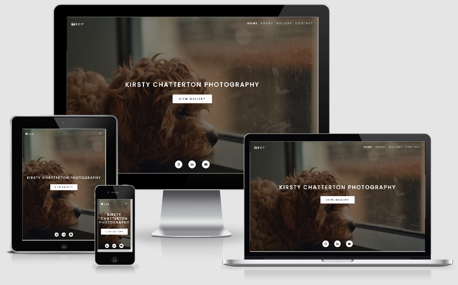
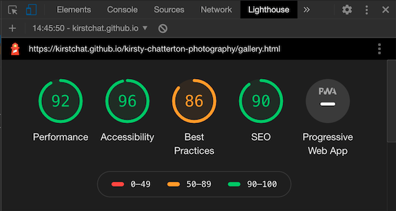
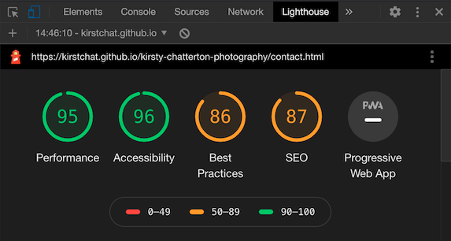

# Kirsty Chatterton Photography

Kirsty Chatterton Photography is a personal photography portfolio, showcasing my work as a hobbyist photographer.


Image from [Am I Responsive](http://ami.responsivedesign.is/?url=https%3A%2F%2Fkirstchat.github.io%2Fkirsty-chatterton-photography%2F)

A demo of the website can be found here: [www.kirstychattertonphotography.com](https://kirstchat.github.io/kirsty-chatterton-photography/)

---

## Contents

- [**User Experience (UX)**](<#user-experience-(ux)>)

  - Project Goals
  - User Goals
  - Design
    - Colour Scheme
    - Typograhpy
    - Imagery
  - Wireframes

- [**Features**](#features)

  - Features that have been implemented
  - Features left to be implemented

- [**Technologies**](#technologies-used)

  - Languages Used
  - Frameworks, Libraries and Programs Used

- [**Testing**](#testing)

- [**Deployment**](#deployment)

- [**Credits**](#credits)

---

## User Experience (UX)

### Project Goals

The goal of this project is to create a personal photography portfolio to show the different types of images I have captured throughtout my time as a hobbyist photographer. The website will show that I have experience photographing events, landscapes, pets and street photography. By creating this website, I hope to start receiving paid work and/or collaboration work that will help me gain more experience in the field and improve my skills as a photographer.

### User Goals

- As a **user**, I want to easily understand the main purpose of the site on my first visit
- As a **user**, I want to be able to easily navigate throughout the site to find content
- As a **user**, I want to see what type of work the photographer has done
- As a **user**, I want to find out more about the photographer and where they're located so I can book them for an event or other photography sessions
- As a **user**, I want to be able to easily contact the photographer to book them for an event or session, and to ask any other quesions I may have about their work

### Site Owner Goals

- As a **site owner**, I want the name of the site to be the main feature of the home page so the user can understand what the site is on their first visit
- As a **site owner**, I want to include navigation links on every page so the user can easily navigate throughout site
- As a **site owner**, I want to include a gallery featuring the different styles of images I have captured to show the user what type of work I have done
- As a **site owner**, I want to include a short bio to give the user a breif overview of who I am and what I do as well as let them know where I'm located if they wish to book a session
- As a **site owner**, I want to include links to social media pages I am regularly active on so the user can easily contact me and see what I've been up to recently if they're interested

### Design

I wanted to keep the overall design of the site minimal and simple so that it's easy use and navigate. As it's a photography website, I wanted the main focus to be the images so I've included a background image on each page so the user can see some of my work before navigating to the gallery. On each of the background images, I've included a black color overlay with a reduced opacity so the user can easily see the text, buttons and navigation bar without being distracted by the background image.

The site layout is easy to follow with a navigation bar at the top, the content in the middle and social links in the footer. The site is made up of three pages: "Home", "Gallery" and "Contact". Rather than including a separate page for "About", I've added a modal that can be opened on each page.

#### Colour Scheme


As I wanted the main focus for this site to be the images, I decided on a neutral color scheme which I created using [coolors.co](https://coolors.co/). As you can see in the image above, I haven't included any bright colors but have instead chose different shades of white, grey and black. This is so the colors used for things like text and buttons don't clash with the colors in the images.

#### Typography

Throughout the site, I used two fonts from [Google Fonts](https://fonts.google.com/) - "Poppins" and "Raleway". I chose these fonts as they were a suggested pairing so they compliment each other and they are also both easy to read. I initially imported a number of font weights for each, ranging from 200 to 700 but after starting the site and testing different font weights, I decided on font weights 300, 500 and 700. "Poppins" is the main font used throughout the site and is set to uppercase where as "Raleway" was used for content in the "About" modal and the contact form.

#### Imagery

The images featured on this site are all my own images that I have captured over the last couple of years as part of my job and also in my free time. These include images of work events/gigs, landscapes, street style photography, and my personal favourite - pets. Although for now, this section only features dogs!

### Wireframes

The wireframes for my site were created using [Balsamiq](https://balsamiq.com/). I created wireframes for desktop as well as mobile and tablet. The final design of the site closely follows the wireframes created during the design process which can be found in the links below:

| Desktop | Tablet | Mobile |
| :-----: | :----: | :----: |
| [Home Page](https://github.com/KirstChat/kirsty-chatterton-photography/blob/master/assets/wireframes/photography-desktop-home.pdf) | [Home Page](https://github.com/KirstChat/kirsty-chatterton-photography/blob/master/assets/wireframes/photography-tablet-home.pdf) | [Home Page](https://github.com/KirstChat/kirsty-chatterton-photography/blob/master/assets/wireframes/photography-mobile-home.pdf) |
| [About Modal](https://github.com/KirstChat/kirsty-chatterton-photography/blob/master/assets/wireframes/photography-desktop-about.pdf) | [About Modal](https://github.com/KirstChat/kirsty-chatterton-photography/blob/master/assets/wireframes/photography-tablet-about.pdf) | [About Modal](https://github.com/KirstChat/kirsty-chatterton-photography/blob/master/assets/wireframes/photography-mobile-about.pdf) |
| [Gallery Page](https://github.com/KirstChat/kirsty-chatterton-photography/blob/master/assets/wireframes/photography-desktop-gallery.pdf) | [Gallery Page](https://github.com/KirstChat/kirsty-chatterton-photography/blob/master/assets/wireframes/photography-tablet-gallery.pdf) | [Gallery Page](https://github.com/KirstChat/kirsty-chatterton-photography/blob/master/assets/wireframes/photography-mobile-gallery.pdf) |
| [Contact Page](https://github.com/KirstChat/kirsty-chatterton-photography/blob/master/assets/wireframes/photography-desktop-contact.pdf) | [Contact Page](https://github.com/KirstChat/kirsty-chatterton-photography/blob/master/assets/wireframes/photography-tablet-contact.pdf) | [Contact Page](https://github.com/KirstChat/kirsty-chatterton-photography/blob/master/assets/wireframes/photography-mobile-contact.pdf) |

#### [Contents](#contents)
---

## Features

### Features that have been implemented

- Responsive on all devices.
- Eye-catching background/hero image on every page.
- Easy to use navigation bar located at the top of every page with links to all other pages on the site.
- An "About Me" modal on every page with a short bio on the photographer.
- A gallery page with filtering buttons to show the different styles of images.
- A contact form that will allow the user to send a message with any requests they have such as booking me for an event or photography session, as well as any other questions or feedback they may have about my work.
- Social media links to Instagram and LinkedIn located in the footer on every page as well as a link to the contact form.

### Features left to be implemented

- Testimonial section

  - This is a feature I'd like to implement when I have gained more experience/work as a photographer.

- Blog Posts
  - This is a potential feature I'd like to implement to show users what equipment I use, other equipment I'd recommend, and tutorial posts to show my photo editing process. This is a feature that will only be implemented if there is enough interest.

#### [Contents](#contents)
---

## Technologies Used

### Languages

- [HTML5](https://developer.mozilla.org/en-US/docs/Web/HTML)
- [CSS3](https://developer.mozilla.org/en-US/docs/Web/CSS)

### Frameworks, Libraries and Programs

- [Bootstrap v4.5](https://getbootstrap.com/)
  - Bootstrap was used to give the website a simple, responsive layout and to also add other features including a navigation bar, a modal and a form.
- [Google Fonts](https://fonts.google.com/)
  - Google Fonts was used to link the "Poppins" and "Raleway" fonts in each of the html files.
- [Font Awesome](https://fontawesome.com/)
  - Font Awesome was used to add icons for social media/contact links throughout the site. It was also used to add icons to buttons on each of the pages and also in the NavBar Brand.
- [Git](https://git-scm.com/)
  - Git was used for version control by utilising the GitPod terminal to commit to Git and push to GitHub.
- [GitHub](https://github.com/)
  - GitHub was used to store the project code that was pushed from GitPod.
- [Gitpod](https://www.gitpod.io/)
  - GitPod was the online IDE used to code the project.
- [Balsamiq](https://balsamiq.com/)
  - Balsamiq was used to create the wireframes for desktop, tablet and mobile during the design process.

#### [Contents](#contents)

---

## Testing

The W3C Markup Validator and W3C CSS Validator was used to validate every page of the project to ensure there were no syntax errors in the project. The following shows the results that were displayed upon checking each page:

- [W3C Markup Validator](https://validator.w3.org/)
  - index.html - No errors or warnings to show.
  - gallery.html - No errors or warnings to show.
  - contact.html - No errors or warnings to show.


- [W3C CSS Validator](https://jigsaw.w3.org/css-validator/#validate_by_input)
  - style.css - No error found.
  - The validator did display a warning for the use of -webkit-background-size.

### Testing User Stories from UX Section

As a **user**, I want to easily understand the main purpose of the site on my first visit:
- I've added a background image to the "Home" page with the title of the website (Kirsty Chatterton Photography) positioned in the center of the page in a large and easy to read font so the user has an understanding of what the site is when they first visit.
- I've also included a button linking to the "Gallery" below the page title on the site which also helps to reinforce what the site is.

As a **user**, I want to be able to easily navigate throughout the site to find content:
- I've added a navigation bar to the top of every page on the site with links to each of the pages which are "Home", "Gallery" and "Contact".

As a **user**, I want to see what type of work the photographer has done:
- I've added a gallery page with four buttons that will display different image galleries when each button is clicked. 

As a **user**, I want to find out more about the photographer and where they're located so I can book them for an event or other photography sessions:
- I've added a modal on each page for the "About" section which can be accessed from the navigation bar at the top of each page. When the user clicks "About" in the navigation bar, the modal will pop up with a short bio on the photographer and where they're currently located.
- I've also included my current location on the "Contact" page.

As a **user**, I want to be able to easily contact the photographer to book them for an event or session, and to ask any other quesions I may have about their work:
- I've added a "Contact" page on the site with a form which the user can complete to send me a message.
- I've added social links to the footer on each page. These link to Instagram, LinkedIn and the "Contact" page on the site. Instagram and LinkedIn will open in a new tab/window so the user can easily come back to the site. 
- I've also included my email address on the "Contact" page which will open a new email window when clicked by the user. This gives the user the option to contact me by filling in the form, by sending me a message on one of my social media pages or by sending me an email.

### Further Testing

As well as running each page through a validator and testing user stories, I also tested the responsiveness of the site across a number of devices and different browsers:
- The site was tested during the development process using Chrome DevTools to test the responsiveness on different devices before pushing any changes to GitHub.
- On completion of the project, the site was tested in Chrome, Safari and FireFox.
- The site was also tested on personal devices in Chrome and Safari. Devices include a MacBook Pro, iPad and iPhone 11.
- I also used a site called [Responsinator](https://www.responsinator.com/) to test the responsiveness of the site across different sized tablet and mobile devices that I don't have access to.

As well as testing the responsiveness of the site, I also tested the performance of each page using [Lighthouse](https://developers.google.com/web/tools/lighthouse) in Chrome DevTools. This was a suggestion from my mentor (Antonija Simic) to check how quickly images would load on desktop and mobile devices. The scores for each page can be found below: 

- index.html:


- gallery.html:



- contact.html:



Each page was also tested individualy to check that:
- Images load properly
- Buttons link to the correct page/external website
- External links open in a new tab/window
- Form validation works 

The site was also tested and reviewed by my mentor as well as some Code Institute students from the June 2020 Cohort.

### Known Bugs

There were some bugs during the developement process which can be found below:

Fixed Positioning issues on Mobile Devices

- As I wanted a fixed/no-scroll page on a desktop, I initially started by "fixing" the positioning of the title and the footer on the "Home" page but found this to be an issue when viewing the site on a mobile device (particularly landscape) as the content looked "squished" together.
- I tried correcting the issue by changing the margin and padding but this didn't solve the issue and instead moved the positioning of the content.
- I corrected this issue by searching for different ways to have the footer always positioned at the bottom without "fixing" its position and found a tutorial on [CSS Tricks](https://css-tricks.com/couple-takes-sticky-footer/) on "sticky footers".
- I used part of the code from the flexbox example which helped solve the issue by changing the display of the body to flex and setting its direction to column.
- I also set height for html to 100% and the height of the body to 100vh as suggested in the example.
- To then center the main content, I set the top and bottom margin to auto as sugegsted in the example, which helped keep the footer at the bottom of the viewport.

Images

- One of the bugs found towards the end of developement was the load time of images which slowed down the performace of each page. This was noticed by my mentor during a review of my code.
- To solve this issue, I searched for ways to compress image sizes and found this guide for [Optimising Images for Web](https://www.abetterlemonadestand.com/optimizing-images-for-web/) - this had also been previously shared on the Slack Community as I found out later.
- This guide linked to some recommended sites for compressing images - I decided to use [Tiny Jpg](https://tinyjpg.com/) to compress all the images used on the site.
- After compressing all my images and running the site through Lighthouse, the performance score had improved and load times were much quicker.

Despite some bugs during development, there are no major known bugs on the site but there is a minor bug that was discovered by one of my peers:

- The hover state of the social media buttons doesn't revert back to it's original color when clicked/touched on a mobile device.
- This is a common issue on mobile devices as discovered after a quick Google search and from my understanding, requires JavaScript to solve the issue. 

#### [Contents](#contents)

---

## Deployment

### GitHub Pages

The project was deployed to GitHub Pages using the following steps:

1. After pushing the project to GitHub, I opened the GitHub site and logged in.
2. After logging in, I located the repository for the project: [github.com/KirstChat/kirsty-chatterton-photography](https://github.com/KirstChat/kirsty-chatterton-photography)
3. At the top of the repository, I clicked on the "Settings" button.
4. On the settings page, I scrolled down to the "GitHub Pages" section.
5. Under "Source", I selected "Master Branch" from the dropdown menu.
6. After the page refreshed itself, I scrolled back down to the "GitHub Pages" section to retrive the link to the published site.

The site can be viewed here: [https://kirstchat.github.io/kirsty-chatterton-photography/](https://kirstchat.github.io/kirsty-chatterton-photography/)

### Making a Local Clone

To clone the repository to make a local copy on your computer, follow these steps:

1. Open GitHub and locate the GitHub repository: [github.com/KirstChat/kirsty-chatterton-photography](https://github.com/KirstChat/kirsty-chatterton-photography)
2. Under the repository name, click "Code" or "Clone" and copy the link to clone the repository using "HTTPS".
4. After copying the link, open terminal on your computer. This step can also be done in the terminal on an IDE.
5. Change the current working directory to the location where you want the cloned directory to be saved.
6. Type git clone, and then paste the URL: [https://github.com/KirstChat/kirsty-chatterton-photography](https://github.com/KirstChat/kirsty-chatterton-photography)- see example below:
```
git clone https://github.com/KirstChat/kirsty-chatterton-photography.git
```
7. Press Enter to create a local clone.

#### [Contents](#contents)

---

## Credits

### Code

- [MDN Target Selector](https://developer.mozilla.org/en-US/docs/Web/CSS/:target) - This was recommended by my mentor (Antonija Simic) to help create a filter like image gallery without the use of JavaScript.  
- [CSS Tricks: Background Image](https://css-tricks.com/perfect-full-page-background-image/) - The code from this example was used to help center the background image on every page.
- [CSS Tricks: Tinted Images](https://css-tricks.com/tinted-images-multiple-backgrounds/) - The code from this example was used to add a color overlay on background image on every page so both text and buttons are clearly visible on top of the background image.
- [CSS Tricks: Sticky Footer](https://css-tricks.com/couple-takes-sticky-footer/) - Part of the code from the flexbox example was used to help position elements on a single page with none/minimal scroll.

### Content

- All content on the site was written by the developer.
- The README.md is based on the Code Institute sample README.

### Media

- All images used on the site were created by the developer.
- All images were optimised for web using [Tiny JPG](https://tinyjpg.com/).
- The image used in the "About" modal was previously cropped using [Crop Circle](https://crop-circle.imageonline.co/#circlecropresult) before starting the project.

### Acknowledgements

- I'd like to thank my mentor Antonija Simic for all her feedback and advice on this project - especially for her suggestion to check out the CSS target selector which helped to achieve a filter like image gallery.
- I'd also like to thank Aukje van der Wal and Neringa Bickmore for sharing examples of their README files during one of the daily calls on Slack - seeing additional examples of README files along with the Code Institue example was very helpful! 
- And finally, I'd like to thank the Code Institute Slack community for all their help and feedback - they really are an amazing bunch of people! 

#### [Contents](#contents)