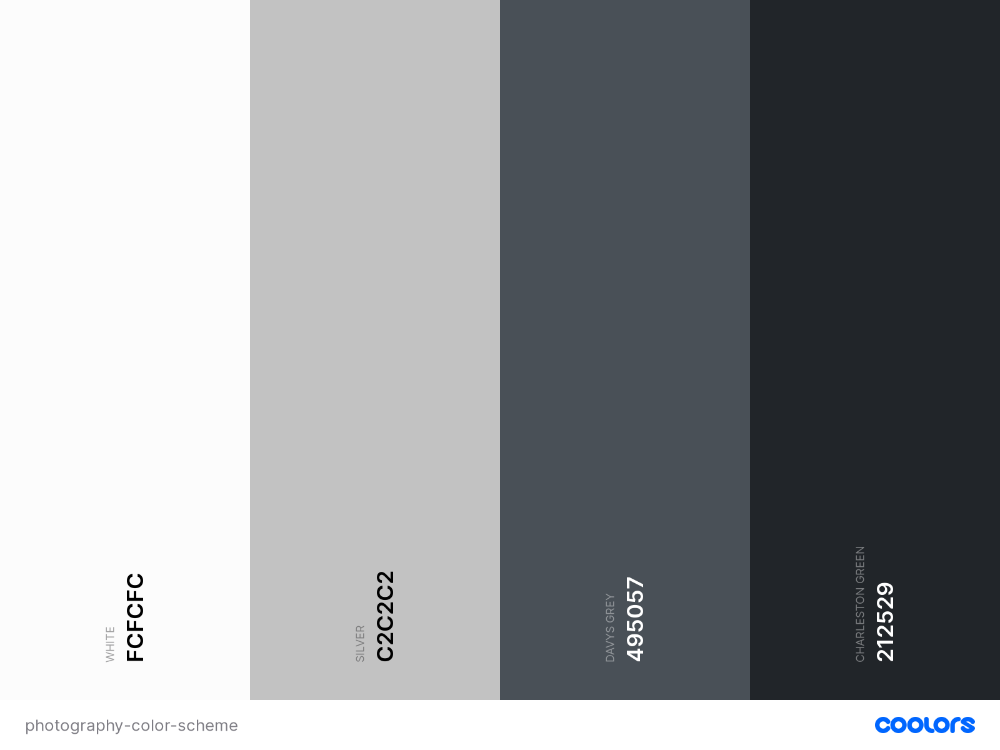

# Kirsty Chatterton Photography

Kirsty Chatterton Photography is a personal photography portfolio, showcasing my work as a hobbyist photographer.

A demo of the website can be found here: [www.kirstychattertonphotography.com](https://kirstchat.github.io/kirsty-chatterton-photography/)

---

## Contents

- [**User Experience (UX)**](<#user-experience-(ux)>)

  - Project Goals
  - User Goals
  - Design
    - Colour Scheme
    - Typograhpy
    - Imagery
  - Wireframes

- [**Features**](#features)

  - Features that have been implemented
  - Features left to be implemented

- [**Technologies**](#technologies-used)

  - Languages Used
  - Frameworks, Libraries and Programs Used

- [**Testing**](#testing)

- [**Deployment**](#deployment)

- [**Credits**](#credits)

---

## User Experience (UX)

### Project Goals

The goal of this project is to create a personal photography portfolio to show the different types of images I have captured throughtout my time as a hobbyist photographer. The website will show that I have experience photographing events, landscapes, pets and street photography. By creating this website, I hope to start receiving paid work and/or collaboration work that will help me gain more experience in the field and improve my skills as a photographer.

### User Goals

- As a **user**, I want to easily understand the main purpose of the site on my first visit
- As a **user**, I want to be able to easily navigate throughout the site to find content
- As a **user**, I want to see what type of work the photographer has done
- As a **user**, I want to find out more about the photographer and where they're located so I can book them for an event or other photography sessions
- As a **user**, I want to be able to easily contact the photographer to book them for an event or session, and to ask any other quesions I may have about their work

### Site Owner Goals

- As a **site owner**, I want the name of the site to be the main feature of the home page so the user can understand what the site is on their first visit
- As a **site owner**, I want to include navigation links on every page so the user can easily navigate throughout site
- As a **site owner**, I want to include a gallery featuring the different styles of images I have captured to show the user what type of work I have done
- As a **site owner**, I want to include a short bio to give the user a breif overview of who I am and what I do as well as let them know where I'm located if they wish to book a session
- As a **site owner**, I want to include links to social media pages I am regularly active on so the user can easily contact me and see what I've been up to recently if they're interested

### Design

I wanted to keep the overall design of this website minimal and simple so that it's easy use and navigate. As it's a photography website, I wanted the main focus to be the images so I've included a background image on each page so the user can see some of my work before navigating to the gallery. On each of the background images, I've included a black color overlay with a reduced opacity so the user can easily see the text, buttons and navigation bar without being distracted by the background image.

The site layout is easy to follow with a navigation bar at the top, the content in the middle and social links in the footer. The site is made of of three pages: "Home", "Gallery" and "Contact". Rather than including a separate page for "About", I've added a modal which can be opened on each page.

#### Colour Scheme

As I wanted the main focus for this site to be the images, I decided on a neutral color scheme which I created using [coolors.co](https://coolors.co/). As you can see in the image above, I haven't included any bright colors but have instead chose different shades of white, grey and black. This is so the colors used for things like text and buttons don't clash with the colors in the images.

#### Typography

Throughout the site, I used two fonts from [Google Fonts](https://fonts.google.com/). The two fonts used were "Poppins" and "Raleway", with "Raleway" being a suggested pairng for the "Poppins" font, as they're both easy to read. I initially imported a number of font weights for each, ranging from 200 to 700 but after starting the site and testing different font weights, I decided on font weights 300 and 500. "Poppins" is the main font used throughout the site and is set to uppercase where as "Raleway" was used for content in the "About" modal and the contact form.

#### Imagery

The images featured on this site are all my own images that I have captured over the last couple of years as part of my job and also in my free time. These include images of work events/gigs, landscapes, street style photography, and my personal favourite - pets. Although for now, this section only features dogs!

### Wireframes

The wireframes for my site were created using [Balsamiq](https://balsamiq.com/). The site is made up of three pages with a modal feature on each page for the "About Me" section. There is also a gallery page and a contact page. I created wireframes for desktop as well as mobile and tablet. The final design of the site closely follows the wireframes created during the design process which can be found in the links below:

#### Desktop

- [Home Page](https://github.com/KirstChat/kirsty-chatterton-photography/blob/master/assets/wireframes/photography-desktop-home.pdf)
- [About Modal](https://github.com/KirstChat/kirsty-chatterton-photography/blob/master/assets/wireframes/photography-desktop-about.pdf)
- [Gallery Page](https://github.com/KirstChat/kirsty-chatterton-photography/blob/master/assets/wireframes/photography-desktop-gallery.pdf)
- [Contact Page](https://github.com/KirstChat/kirsty-chatterton-photography/blob/master/assets/wireframes/photography-desktop-contact.pdf)

#### Tablet

- [Home Page](https://github.com/KirstChat/kirsty-chatterton-photography/blob/master/assets/wireframes/photography-tablet-home.pdf)
- [About Modal](https://github.com/KirstChat/kirsty-chatterton-photography/blob/master/assets/wireframes/photography-tablet-about.pdf)
- [Gallery Page](https://github.com/KirstChat/kirsty-chatterton-photography/blob/master/assets/wireframes/photography-tablet-gallery.pdf)
- [Contact Page](https://github.com/KirstChat/kirsty-chatterton-photography/blob/master/assets/wireframes/photography-tablet-contact.pdf)

#### Mobile

- [Home Page](https://github.com/KirstChat/kirsty-chatterton-photography/blob/master/assets/wireframes/photography-mobile-home.pdf)
- [About Modal](https://github.com/KirstChat/kirsty-chatterton-photography/blob/master/assets/wireframes/photography-mobile-about.pdf)
- [Gallery Page](https://github.com/KirstChat/kirsty-chatterton-photography/blob/master/assets/wireframes/photography-mobile-gallery.pdf)
- [Contact Page](https://github.com/KirstChat/kirsty-chatterton-photography/blob/master/assets/wireframes/photography-mobile-contact.pdf)

---

## Features

### Features that have been implemented

- Responsive on all devices.
- Eye-catching background/hero image on every page.
- Easy to use navigation bar located at the top of every page with links to all other pages on the site.
- An "About Me" modal on every page with a short bio on the photographer.
- A gallery page with filtering buttons to show the different styles of images.
- A contact form that will allow the user to send a message with any requests they have such as booking me for an event or photography session, as well as any other questions or feedback they may have about my work.
- Social media links to Instagram and LinkedIn located in the footer on every page as well as a link to the contact form.

### Features left to be implemented

- Testimonial section

  - This is a feature I'd like to implement when I have gained more experience/work as a photographer.

- Blog Posts
  - This is a potential feature I'd like to implement to show users what equipment I use, other equipment I'd recommend, and tutorial posts to show my photo editing process. This is a feature that will only be implemented if there is enough interest.

---

## Technologies Used

### Languages

- [HTML5](https://developer.mozilla.org/en-US/docs/Web/HTML)
- [CSS3](https://developer.mozilla.org/en-US/docs/Web/CSS)

### Frameworks, Libraries and Programs

- [Bootstrap v4.5](https://getbootstrap.com/)
  - Bootstrap was used to give the website a simple, responsive layout and to also add other features including a navigation bar and a modal.
- [Google Fonts](https://fonts.google.com/)
  - Google Fonts was used to import the "Poppins" and "Raleway" font into the style.css file that is used across all pages throughtout the site.
- [Font Awesome](https://fontawesome.com/)
  - Font Awesome was used to add icons for social media/contact links throughout the site. It was also used to add icons to buttons on each of the pages and also in the NavBar Brand.
- [Git](https://git-scm.com/)
  - Git was used for version control by utilising the GitPod terminal to commit to Git and push to GitHub.
- [GitHub](https://github.com/)
  - GitHub was used to store the project code that was pushed from GitPod.
- [Gitpod](https://www.gitpod.io/)
  - GitPod was used to code the project.
- [Balsamiq](https://balsamiq.com/)
  - Balsamiq was used to create the wireframes for desktop, tablet and mobile during the design process.

---

## Testing

The W3C Markup Validator and W3C CSS Validator was used to validate every page of the project to ensure there were no syntax errors in the project: 

- **Add Results Later**

### Testing User Stories from UX Section

As a **user**, I want to easily understand the main purpose of the site on my first visit:
- I've added a background image to the "Home" page with the title of the website (Kirsty Chatterton Photography) positioned in the center of the page in a large and easy to read font so the user knows what the site is.

As a **user**, I want to be able to easily navigate throughout the site to find content:
- I've added a navigation bar to the top of every page on the site with links to each of the pages which are "Home", "Gallery" and "Contact".

As a **user**, I want to see what type of work the photographer has done:
- I've added a gallery page with four buttons that will display different image galleries when each button is clicked.

As a **user**, I want to find out more about the photographer and where they're located so I can book them for an event or other photography sessions:
- I've added a modal on each page for the "About" section which can be accessed from the navigation bar at the top of each page. When the user clicks "About" in the navigation bar, the modal will pop up with a short bio on the photographer and where they're currently located.

As a **user**, I want to be able to easily contact the photographer to book them for an event or session, and to ask any other quesions I may have about their work:
- I've added social links to the footer on each page. These will link to Instagram, LinkedIn and the "Contact" page on the site. Instagram and LinkedIn will open in a new tab/window so the user can easily come back to the website.

### Further Testing

### Known Bugs

---

## Deployment

### GitHub Pages

The project was deployed to GitHub Pages using the following steps:

1. Log in to GitHub and locate the GitHub Repository
2. At the top of the Repository, click on the "Settings" Button on the menu.
3. Scroll down the Settings page to the "GitHub Pages" Section.
4. Under "Source", click the dropdown called "None" and select "Master Branch". The page will automatically refresh.
5. Scroll back down through the page to locate the now published site link in the "GitHub Pages" section.

The site can be viewed here: [https://kirstchat.github.io/kirsty-chatterton-photography/](https://kirstchat.github.io/kirsty-chatterton-photography/)

### Making a Local Clone

1. Log in to GitHub and locate the GitHub Repository
2. Under the repository name, click "Clone or download".
3. To clone the repository using HTTPS, under "Clone with HTTPS", copy the link.
4. Open your IDE and open the terminal
5. Change the current working directory to the location where you want the cloned directory to be made.
6. Type git clone, and then paste the URL: [https://github.com/KirstChat/kirsty-chatterton-photography](https://github.com/KirstChat/kirsty-chatterton-photography)
7. Press Enter. Your local clone will be created.

---

## Credits

### Code

- [MDN Target Selector](https://developer.mozilla.org/en-US/docs/Web/CSS/:target) - This was recommended by my mentor (Antonija Simic) to help create a filter like image gallery without the use of JavaScript.  
- [CSS Tricks: Background Image](https://css-tricks.com/perfect-full-page-background-image/) - The code from this example was used to help center the background image on every page.
- [CSS Tricks: Tinted Images](https://css-tricks.com/tinted-images-multiple-backgrounds/) - The code from this example was used to add a color overlay on background image on every page so both text and buttons are clearly visible on top of the background image.
- [CSS Tricks: Sticky Footer](https://css-tricks.com/couple-takes-sticky-footer/) - Part of the code from the flexbox example was used to help position elements on a single page with none/minimal scroll.

### Content

- All content on the site was written by the developer
- The README.md is based on the Code Institute sample README

### Media

- All images used on the site were created by the developer
- All images were omptimised for web using [Tiny JPG](https://tinyjpg.com/)

### Acknowledgements

- My mentor Antonija Simic
- The Code Institute Slack community
